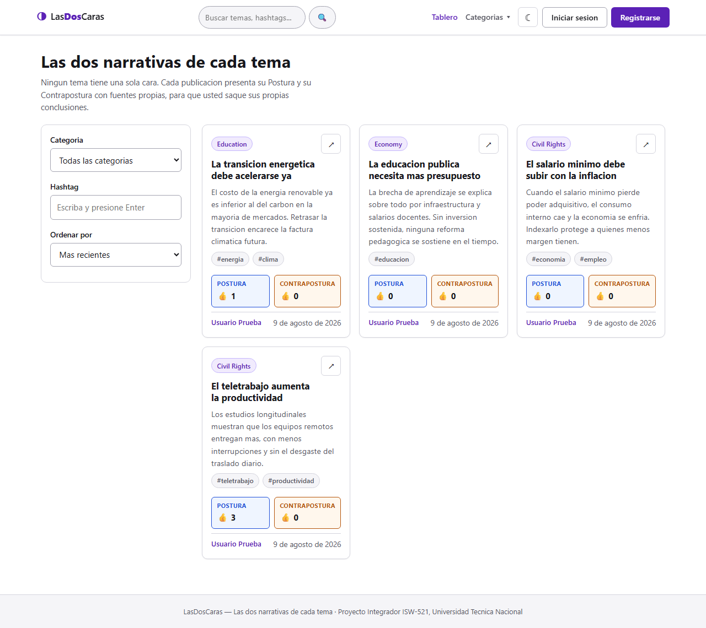
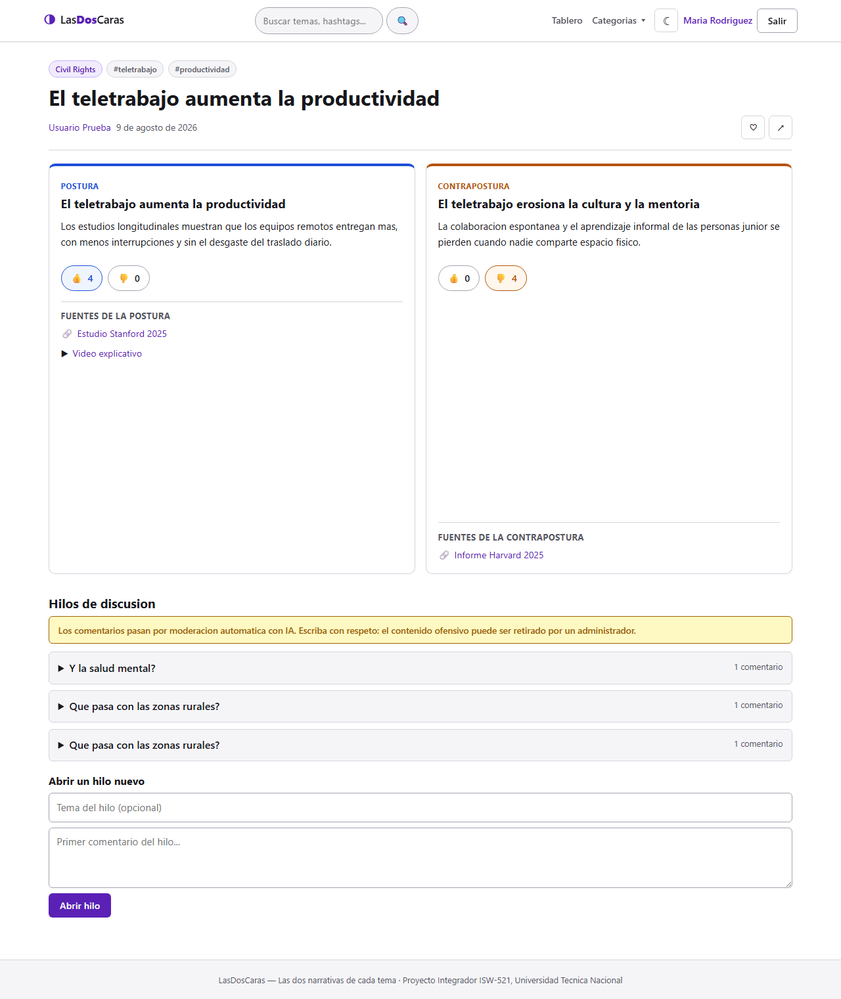
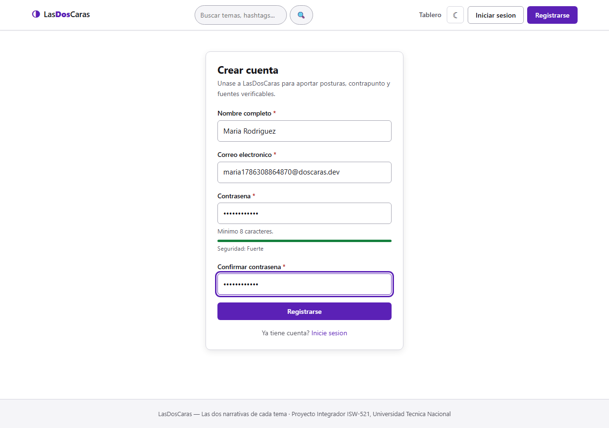
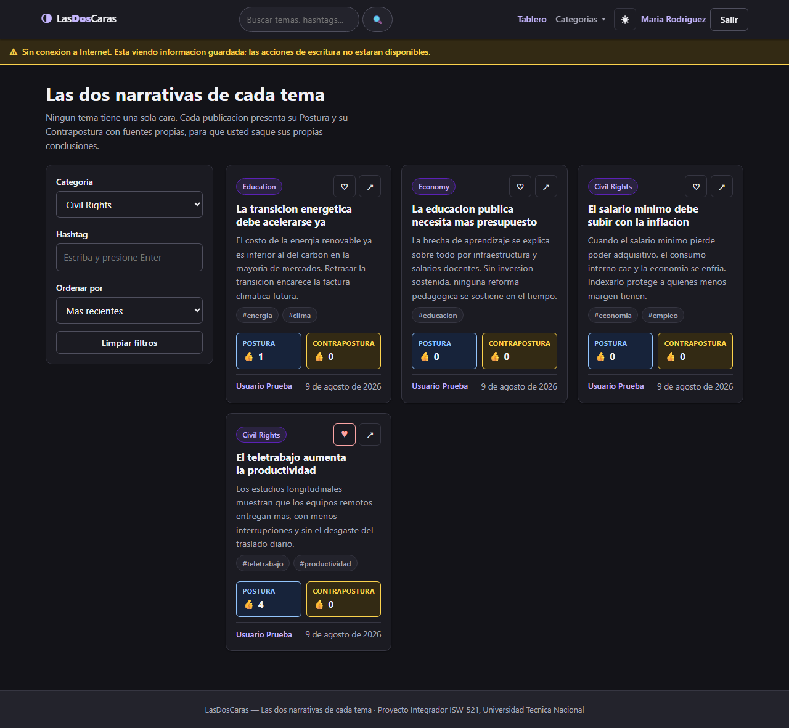
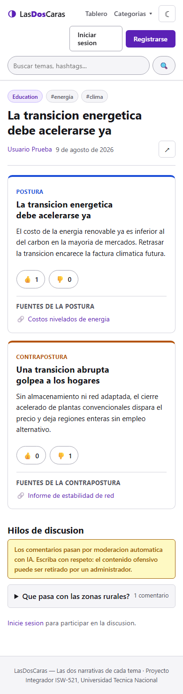

# LasDosCaras — Frontend

Aplicación web de una sola página (SPA) que presenta siempre **las dos narrativas de cada
tema**: cada publicación tiene una *Postura* (Lado A) y una *Contrapostura* (Lado B), cada
una con su propio título, argumento, fuentes de referencia y contadores de reacciones
completamente independientes.

Proyecto Integrador Final — **ISW-521 Programación en Ambiente Web I**
Universidad Técnica Nacional · II Cuatrimestre 2026 · Prof. Bladimir Arroyo B.

## Integrantes

| Integrante | Correo |
| --- | --- |
| Alejandro Corrales Rivera | alejandrocorrales2105@gmail.com |
| Samuel Fernández | fernandezsamuel989@gmail.com |

## Stack

| Pieza | Tecnología |
| --- | --- |
| Framework | React 19 + React Router 7 |
| Lenguaje | TypeScript en modo `strict`, sin `any` |
| Build | Vite 8 |
| Estilos | CSS3 propio con variables, *mobile-first* |
| Linter | Oxlint |
| Backend | `doscarasapi` (Express + Prisma + PostgreSQL + JWT) — insumo del curso, **no se modifica** |

---

## Cómo ejecutar el proyecto

Este repositorio contiene solo el frontend. El REST API (`doscarasapi`) es el insumo que
entrega el docente y se ejecuta aparte: son dos programas distintos que se comunican por
HTTP. El frontend no lee el código del API, únicamente consume su URL.

### 1. Levantar el API

Coloque la carpeta `doscarasapi` al lado de este repositorio, de modo que la estructura
quede así:

```
carpeta-de-trabajo/
├── doscarasapi/          ← el API entregado por el docente
└── ProyectoFinalWeb1/    ← este repositorio
```

Lo más rápido es Docker: levanta PostgreSQL y el API juntos, aplica las migraciones y siembra
las categorías y el superadministrador.

```bash
cd ../doscarasapi
docker compose up -d --build      # http://localhost:3000
```

Si prefiere dejar el API en otra ubicación, lo único que importa es que quede escuchando en
la URL que se configure en `VITE_API_URL` (ver más abajo).

Verificación rápida:

```bash
curl http://localhost:3000/health          # {"status":"ok"}
curl http://localhost:3000/api/categories  # {"categories":[...]}
```

Si `categories` viene vacío, ejecute la siembra manualmente:

```bash
docker compose exec api npx prisma db seed
```

Credenciales del superadministrador sembrado: `admin@doscaras.dev` / `ChangeMe123!`.

<details>
<summary>Alternativa sin Docker</summary>

Requiere PostgreSQL instalado localmente:

```bash
cd ../doscarasapi
npm install
cp doscaras/.env.example .env     # editar DATABASE_URL, JWT_SECRET, SUPERADMIN_*
npx prisma migrate dev
npx prisma db seed
npm run dev
```
</details>

### 2. Levantar el frontend

Desde la raíz de **este** repositorio:

```bash
cd ../ProyectoFinalWeb1   # si viene del paso anterior
npm install
cp .env.example .env      # la URL por defecto ya apunta al API local
npm run dev               # http://localhost:5173
```

Otros comandos: `npm run build` (typecheck + bundle de producción), `npm run preview`,
`npm run lint`.

### Variables de entorno

| Variable | Descripción | Valor por defecto |
| --- | --- | --- |
| `VITE_API_URL` | URL base del REST API, **incluyendo el prefijo `/api`** | `http://localhost:3000/api` |

`.env` está en `.gitignore`; `.env.example` se versiona con todas las variables necesarias.

---

## Estado de las pantallas

Las trece pantallas del enunciado están implementadas, cada una bajo el guard que le
corresponde (`RequireGuest`, `RequireAuth` o `RequireSuperadmin`).

| # | Pantalla | Ruta | Guard |
| --- | --- | --- | --- |
| 1 | Tablero principal | `/` | Público |
| 2 | Registro | `/register` | `RequireGuest` |
| 3 | Inicio de sesión | `/login` | `RequireGuest` |
| 4 | Detalle de publicación | `/views/:id` | Público |
| 5 | Crear / editar publicación | `/views/new`, `/views/:id/edit` | `RequireAuth` |
| 6 | Página de categoría | `/categories/:id` | Público |
| 7 | Admin: gestión de usuarios | `/admin/users` | `RequireSuperadmin` |
| 8 | Admin: gestión de categorías | `/admin/categories` | `RequireSuperadmin` |
| 9 | Admin: moderación de contenido | `/admin/moderation` | `RequireSuperadmin` |
| 10 | Perfil de usuario | `/profile` | `RequireAuth` |
| 11 | Perfil público de autor | `/authors/:id` | Público |
| 12 | Error 404 / 403 | `/*`, `/403` | Público |
| 13 | Resultados de búsqueda | `/search` | Público |

## Capturas

| Tablero principal | Detalle con las dos caras |
| --- | --- |
|  |  |

| Registro | Modo oscuro y sin conexión |
| --- | --- |
|  |  |

<details>
<summary>Vista móvil (390 px)</summary>


</details>

---

## Arquitectura

```
src/
├── models/          Modelos de dominio (español) + dto.ts (formas crudas del API)
├── services/        Única capa que habla con el API. Ningún componente llama a fetch
│   ├── http.ts          Cliente central: JWT, timeouts, reintento, traducción de errores
│   ├── mappers.ts       Frontera DTO -> dominio
│   ├── cache.service.ts Único acceso a localStorage
│   └── *.service.ts     auth, catalog, views, favorites, authors, history
├── context/         Estado global: sesión (useReducer), notificaciones, tema
├── hooks/           useAuth, useToast, useTheme, useDebounce, useOnlineStatus
├── components/      layout/, routing/ (guards), ui/, views/
├── pages/           Una pantalla por archivo
└── styles/          tokens (temas) → base → components → layout
```

### Traducción entre el API y el dominio

El API es un insumo fijo del curso y **no se modifica**. Su modelo está en inglés y sigue
la forma de Prisma; el enunciado describe el dominio en español y con `ladoA` / `ladoB`
explícitos. Toda la conversión se concentra en `models/dto.ts` + `services/mappers.ts`:

| Dominio (enunciado) | API real | Nota |
| --- | --- | --- |
| `View.ladoA` / `View.ladoB` | `sides[]` con `type: 'SIDE'` / `'COUNTERPART'` | |
| `View.titulo` | *no existe* | Se deriva del título de la Postura: el API no guarda un título por publicación |
| `Side.likes` / `dislikes` | `likeCount` / `dislikeCount` | Por cara, filas distintas en `view_sides` |
| `Side.miReaccion` | `myReaction` | Solo llega si la petición viaja con JWT |
| `Source.titulo` | `label` (opcional) | Sin `label` se muestra la URL |
| `Category.activo` | `deletedAt === null` | El API usa borrado lógico |
| `Category.descripcion` | *no existe* | Queda vacía |
| `User.rol` / `estado` | `role` / `status` | `PENDING` se expone como `pendiente` |
| `Paginated.totalPages` | `total` + `limit` | Se calcula en el cliente |
| Favoritos del usuario | `{ favorites: string[] }` | Solo IDs, no publicaciones completas |
| `Comment.moderado` | *no existe* | El API no expone moderación; queda en `true` |

### Registro en tres pasos

`POST /auth/register` **no devuelve token**: crea la cuenta en estado `PENDING` y entrega un
`activationToken` en la respuesta. Sin activarla, `POST /auth/login` responde **403 "Account
is pending activation"**. Como el API no envía correos, el cliente encadena
`register → GET /auth/activate/:token → login`, de modo que el usuario termina el
formulario ya autenticado (`context/AuthProvider.tsx`).

### Manejo de errores

`services/http.ts` es el único lugar donde se llama a `fetch`. Traduce cada respuesta a un
`ApiError` tipado con `status`, `message` en español y `fieldErrors` para pintar inline:

| Código | Comportamiento |
| --- | --- |
| 400 / 422 | Errores por campo mapeados al input; el mensaje del API se traduce |
| 401 | Limpia la sesión, borra el token y avisa "Su sesión ha expirado" |
| 403 | Muestra el motivo real (sin permisos / cuenta suspendida / sin activar). **No** redirige al login |
| 404 | Mensaje contextual: "Esta publicación no existe o fue eliminada" |
| 409 | Inline en el campo, p. ej. "El correo ya está registrado" |
| 5xx | Mensaje genérico al usuario + `console.error` para depuración |
| Red / timeout | Un reintento automático en los GET antes de mostrar el error |

El API responde en inglés (`{ "error": "Email is already registered" }`) y con la validación
de Zod agrupada bajo `details.fieldErrors.body`; ambas cosas se normalizan en `http.ts`.

### Datos que persiste la aplicación (`localStorage`)

Todo pasa por `services/cache.service.ts`; ningún componente toca `localStorage`
directamente. Cada entrada se guarda envuelta como `{ value, timestamp }` para poder
validar su TTL en la lectura.

| Clave | TTL | Por qué se persiste |
| --- | --- | --- |
| `lasdoscaras_auth` | Hasta logout o 401 | Restaurar la sesión al recargar sin volver a pedir credenciales |
| `lasdoscaras_categories` | 1 hora | Los filtros del tablero deben existir antes de que el API conteste |
| `lasdoscaras_hashtags` | 30 minutos | Sugerencias de autocompletado sin llamada extra |
| `lasdoscaras_filters` | Permanente | El usuario reencuentra el tablero como lo dejó |
| `lasdoscaras_favorites` | Sincronizado al login | Pintar el corazón correcto en el primer render |
| `lasdoscaras_draft` | Hasta publicar o descartar | No perder un formulario largo a medio escribir |
| `lasdoscaras_theme` | Permanente | Se aplica en `index.html` **antes** del primer render (sin FOUC) |
| `lasdoscaras_history` | Permanente (FIFO, 20) | Historial de publicaciones vistas sin consultar el API |
| `lasdoscaras_board` | Sin TTL | Instantánea del último tablero, para el modo sin conexión |

**No se persiste nada sensible.** La contraseña nunca se guarda. El JWT sí vive en
`localStorage`: es vulnerable a XSS, y la alternativa más segura sería una cookie
`httpOnly`, pero el API la tendría que emitir y no lo hace. La mitigación es que el token
expira (`JWT_EXPIRES_IN`, 7 días por defecto) y que cualquier 401 lo borra de inmediato.

---

## Limitaciones conocidas

1. **Ordenar por likes de una cara concreta.** El enunciado pide ordenar por "más likes
   Lado A / Lado B", pero el API solo ordena por la **suma** de ambas caras
   (`sort=likes|dislikes|recent`). Se le pide el orden por likes totales y la página
   recibida se reordena en el cliente por la cara elegida: el orden es exacto dentro de la
   página. Resolverlo del todo exigiría un parámetro nuevo en el API.
2. **Filtro por hashtag.** `GET /views` acepta **un** hashtag por consulta, no una lista;
   el panel de filtros reemplaza el hashtag activo en vez de acumular varios.
3. **Descripción de categorías.** El modelo `Category` del API no tiene el campo.
4. **Moderación de comentarios.** El API no expone estado de moderación; la advertencia se
   muestra y el indicador "en moderación" queda listo para cuando el campo exista.
5. **Búsqueda global: no hay extracto que resaltar.** El enunciado pide resaltar el término
   dentro del título y del extracto de cada resultado. El título sí se resalta, pero el
   extracto no llega: en `search.service.ts` del backend la consulta pide
   `sides: { select: { type: true, title: true } }`, o sea el tipo y el título y nada más.
   Por eso los resultados usan la variante `compacta` de la tarjeta, que oculta el extracto y
   los contadores en vez de mostrar un párrafo vacío y dos ceros. Traerlos obligaría a pedir
   el detalle de cada resultado por separado, hasta 20 peticiones extra por búsqueda.
   `Highlight` ya se aplica al extracto en `ViewCard`, así que el día que el API devuelva la
   descripción funciona sin tocar nada. El endpoint tampoco pagina: devuelve 20 resultados
   como máximo.
6. **La categoría no tiene índice propio.** La miga de pan de la Pantalla 6 muestra
   `Inicio › Categorías › [Nombre]`, pero "Categorías" no es un enlace: la aplicación no
   tiene una pantalla que liste todas las categorías (el enunciado no la pide). El acceso
   es por el menú desplegable de la navbar.
7. **"Mis Publicaciones" no muestra las despublicadas.** `GET /views` filtra siempre por
   `status: PUBLISHED` (ver `listViews` en el backend), incluso con `?autor=me`, así que
   una publicación retirada por un superadmin desaparece de la lista del perfil. El
   indicador de estado está implementado y se pinta si el API llegara a devolverlas; entre
   tanto, la sección avisa al usuario para que la ausencia no se lea como pérdida de datos.
   El autor sí puede abrir la publicación por enlace directo: `GET /views/:id` sí se la
   devuelve.
8. **"Mis Favoritos" hace N+1 peticiones.** `GET /users/me/favorites` devuelve solo IDs, de
   modo que hay que pedir cada publicación por separado. Por eso la pestaña carga de forma
   perezosa, al abrirla, y usa `Promise.allSettled`: un favorito que apunte a una
   publicación ya despublicada responde 404 y no debe tumbar la lista entera.
9. **El API no impide que un superadmin se banee a sí mismo.** `banUser` solo comprueba que
   el usuario exista; no hay error del servidor que manejar. El control que pide el
   enunciado es, por tanto, responsabilidad exclusiva del cliente: en `/admin/users` el
   botón no se renderiza sobre la fila propia.
10. **Desactivar una categoría es irreversible desde la aplicación.** El API hace borrado
    lógico (`deletedAt`), pero tanto `updateCategory` como `softDeleteCategory` empiezan por
    `getActiveCategory`, que responde 404 si la categoría ya está de baja, y no existe ningún
    endpoint que limpie `deletedAt`. Una categoría inactiva es un estado terminal, así que la
    tabla no ofrece "Reactivar": sería un botón que siempre fallaría.
11. **El conteo de publicaciones por categoría se calcula en el cliente.** El API no lo
    expone, así que `listCategoriesWithCounts` pide `GET /views?category=X&limit=1` por
    categoría y se queda con `total`. Solo cuenta las publicadas, que es suficiente para
    advertir antes de desactivar una categoría con contenido.
12. **El 409 al eliminar una categoría no llega nunca.** El enunciado pide manejarlo, pero
    el borrado lógico del API no falla aunque la categoría tenga publicaciones asociadas.
    La advertencia se construye con el conteo del punto anterior; el 409 se maneja igual, de
    forma defensiva, por si el backend cambiara.

## Decisiones de diseño

- **La URL es la única fuente de verdad de los filtros del tablero.** `BoardPage` los
  deriva de `useSearchParams` en cada render en lugar de duplicarlos en `useState`. Así,
  un enlace entrante, el menú de categorías, el botón Atrás del navegador y un enlace
  compartido se comportan todos igual. Con estado propio, un enlace `/?category=X` no
  tenía efecto si el tablero ya estaba montado.
- **Los filtros se persisten en la acción del usuario, no en un efecto.** Un efecto sobre
  `filters` también se dispararía en el primer render con los valores por defecto y
  borraría las preferencias guardadas.
- **`SidePanel` recibe un único `Side` y no conoce la otra cara.** Es la garantía
  estructural de que los contadores de Lado A y Lado B no pueden compartir estado.
- **El menú de categorías usa `<details>/<summary>`.** El navegador ya resuelve el estado
  abierto/cerrado, el foco y la operación por teclado que exige la accesibilidad.
- **Los modales se construyen sobre el `<dialog>` nativo.** Por lo mismo: `showModal()` da el
  *focus trap*, el cierre con Escape, el fondo inerte y la devolución del foco al elemento que
  abrió el diálogo. Hacerlo a mano son decenas de líneas de `useEffect`.
- **Los cambios sin guardar se detectan contra una instantánea del formulario.** Se compara
  serializando a JSON y no campo por campo, porque `FormState` es un árbol (dos lados, cada
  uno con su arreglo de fuentes) y la comparación manual habría que actualizarla cada vez que
  cambie la forma del formulario.

## Convenciones de trabajo

- Ramas por funcionalidad (`feature/...`), integración vía Pull Request a `develop` y de
  ahí a `main`.
- Mensajes de commit convencionales: `feat:`, `fix:`, `refactor:`, `style:`, `docs:`.
